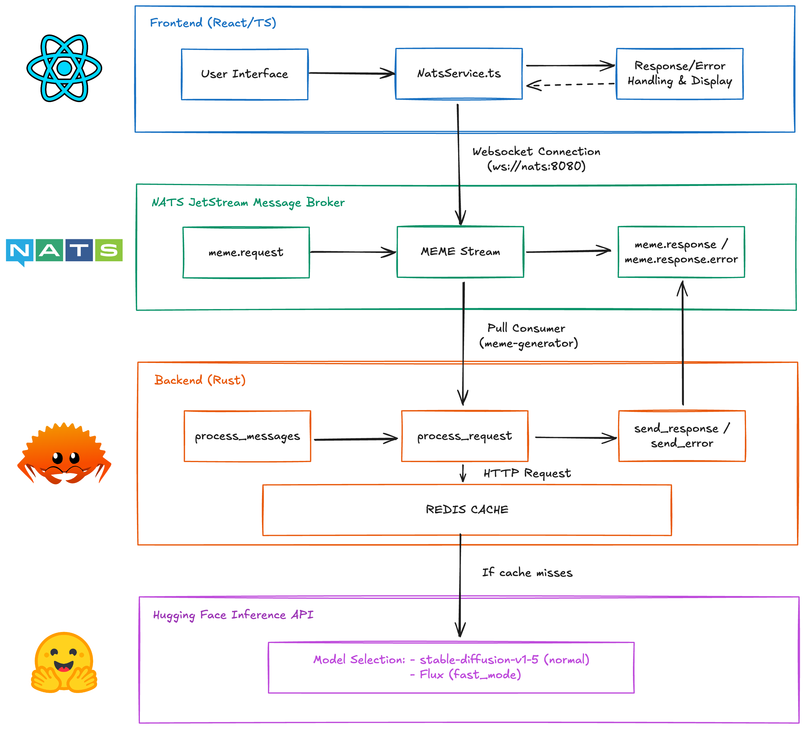

# 🎭 Meme Generator

A Kubernetes demo project showcasing multi-tier auto-scaling with HPA, VPA, and KEDA.

## 📋 Project Overview

This monorepo contains all components for the Meme Generator application, demonstrating different Kubernetes auto-scaling strategies working together:

- **Frontend**: Uses Horizontal Pod Autoscaler (HPA) based on CPU and memory utilization
- **Backend**: Uses Kubernetes Event-Driven Autoscaling (KEDA) based on NATS message queue depth
- **Redis**: Uses Vertical Pod Autoscaler (VPA) for automatic resource adjustment

The application demonstrates a complete message flow from user request to image generation, with comprehensive monitoring and observability.

## 📁 Repository Structure

```
meme-generator/
├── k8s/                    # Kubernetes configurations
│   ├── backend/            # Backend deployment, KEDA ScaledObject
│   ├── frontend/           # Frontend deployment, HPA
│   ├── monitoring/         # Prometheus and Grafana dashboards
│   ├── nats/               # NATS with JetStream configuration
│   ├── operators/          # Operator deployments (VPA, KEDA, metrics-server)
│   └── redis/              # Redis with VPA configuration
├── services/
│   ├── backend/            # Rust backend service scaled by KEDA
│   └── frontend/           # React/TypeScript frontend scaled by HPA
├── stress/                 # Load testing tools for demonstrating auto-scaling
└── docs/                   # Documentation
```

## ⚖️ Auto-scaling Strategy

This application demonstrates three different auto-scaling approaches working together:

1. **Frontend (HPA)**: Scales horizontally based on CPU/memory metrics
   - Very sensitive CPU threshold (30%) to trigger scaling with minimal load
   - Memory threshold at 50%
   - Quick scale-up (0s stabilization window)
   - Conservative scale-down (5-minute stabilization window)
   - Resource configuration: 10m CPU request, 100m CPU limit, 64Mi memory request, 128Mi memory limit

2. **Backend (KEDA)**: Scales based on NATS message queue depth
   - Scales based on NATS JetStream message queue depth
   - Triggers when 5+ messages are pending (activates at just 1 message)
   - Can scale to zero when no messages are present
   - Resource configuration: 50m CPU request, 500m CPU limit, 64Mi memory request, 256Mi memory limit

3. **Redis (VPA)**: Automatically adjusts CPU and memory resources
   - Automatically adjusts CPU and memory resources based on usage patterns
   - Min resources: 100m CPU, 512Mi memory
   - Max resources: 1000m CPU, 1Gi memory

This configuration ensures the system can quickly scale up with minimal load (just a couple of meme generations) and efficiently manage resources.

## 🔄 Message Flow Architecture

The application implements a complete message flow between components:



1. **Frontend**: React/TypeScript application with Material-UI
   - Connects to NATS via WebSockets for communication
   - Sends meme generation requests with unique IDs
   - Subscribes to response and error channels

2. **NATS JetStream**: Message broker with persistent streams
   - Handles `meme.request`, `meme.response`, and `meme.response.error` subjects
   - Provides metrics for queue depth and message processing rates
   - Triggers KEDA scaling based on pending message count

3. **Backend**: Rust application for image generation
   - Processes requests from NATS queue asynchronously
   - Checks Redis cache before calling external APIs
   - Calls Hugging Face API with appropriate model selection
   - Caches results in Redis for improved performance

4. **Monitoring**: Comprehensive metrics and dashboards
   - Grafana dashboards for visualizing auto-scaling behavior
   - Prometheus metrics for NATS, Kubernetes, and application components
   - Custom panels for message rates and cumulative counts

## 🚀 Getting Started

1. **Infrastructure Setup**: See [docs/setup.md](docs/setup.md)
2. **Auto-scaling Guide**: See [docs/auto-scaling.md](docs/auto-scaling.md)
3. **Testing the Application**: See [docs/testing.md](docs/testing.md)
4. **Load Testing**: See [stress/README.md](stress/README.md)

## ⚙️ Prerequisites

- Kubernetes cluster (minikube, kind, or cloud provider)
- kubectl
- Helm (optional - installed by setup script if missing)
- Git
